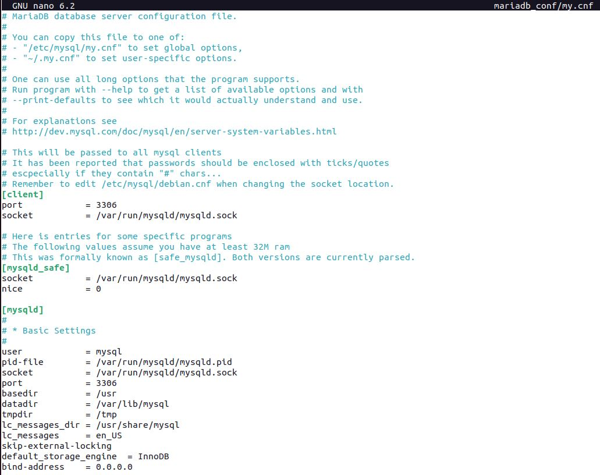
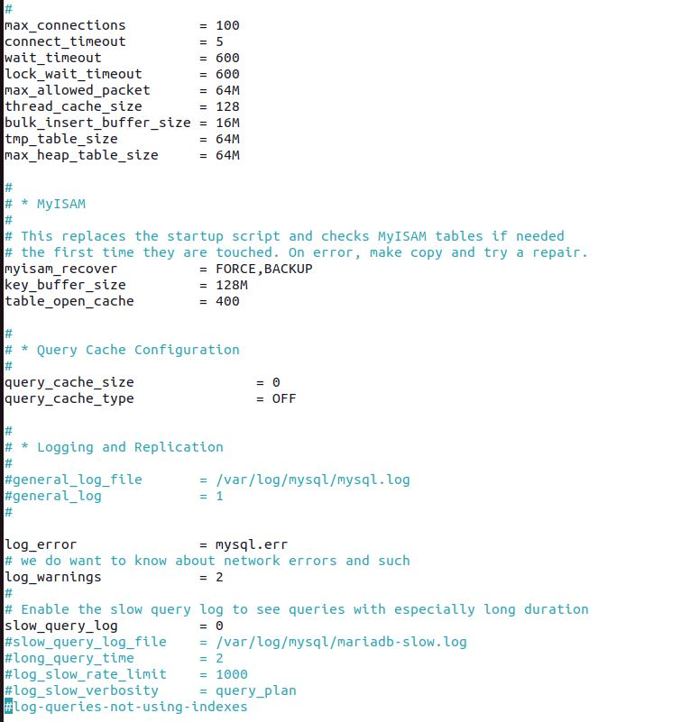
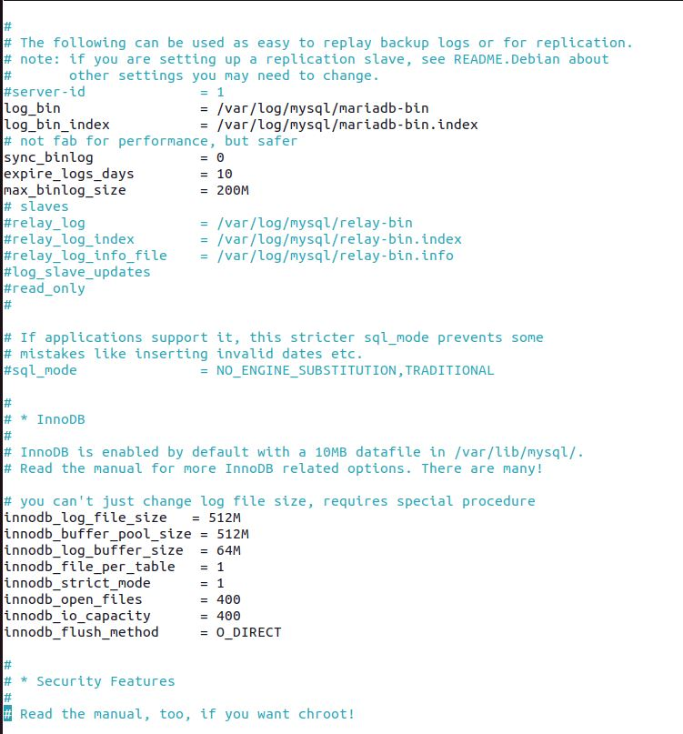
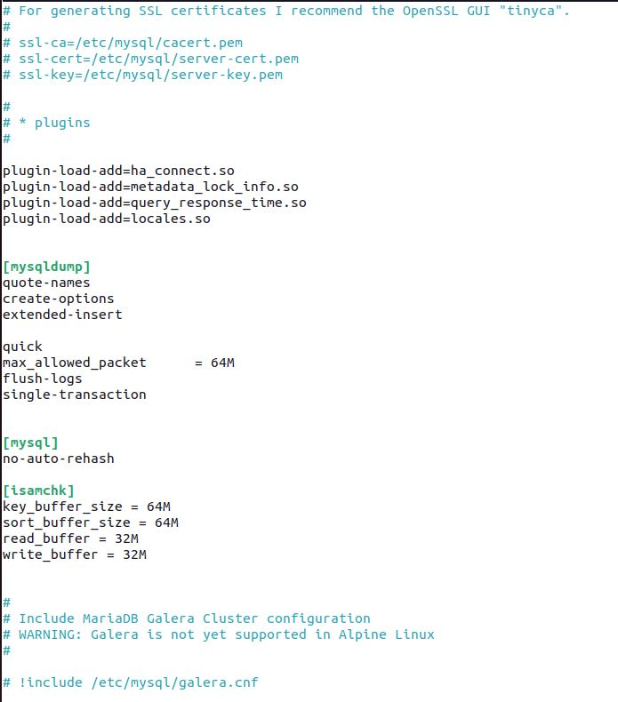

# Урок 4. Dockerfile и слои
## Classwork
Знакомились с работой слоев Dockerfile
## Homework
### Задание: 
- Необходимо собрать образ и запустить из него контейнер. Основой образа должна быть alpine. Установить необходимо mariaDB. 
Уменьшить размер образа (способ обсуждался на лекции); 
- Необходимо открыть порт для коммуникации с другими сущностями(есть в семинаре);
Необходимо смонтировать внешнюю папку для хранения данных БД вне контейнера(было на прошлом занятии);
- Для проверки решения необходимо подключить к такому контейнеру phpmyadmin (нужно, чтобы в нем вы увидели данные из вашей БД).

**Решение:**

Создаем Dockerfile(уменьшение образа достигнуто за счет использования alpine и меньшего количества слоев:

Создаем конфигурационный файл mariadb my.cnf(можно взять с просторов интернета или установить mariadb 
и взять из корневых папок):

Собираем образ и запускаем контейнер:

где флаг -v share_folder:/var/lib/mysql/ создает внешнею папку для хранение данных БД вне контейнера.

Для наглядности:

Заходим в mariadb(как на прошлом семинаре заходили):

к сожалению эта команда не сработала, попробуем иначе:

Создали вновь пользователя и дали ему полные права для БД userdata и db1.

Открываем новый терминал и создаем phpmyadmin:

Запустили phpmyadmin (в контейнере) и через веб проверили работоспособность:

к сожалению в доступе к БД db1 было отказано, но userdata работает.

Вернемся в терминал и посмотрим появиться ли БД userdata:

*Подготовил студент GeekBrains* [**`Костиков Роман`**](https://gb.ru/users/d0da3e74-94c9-4467-a23e-2ee70d85dcdc), 
Seminar_4_containerization

